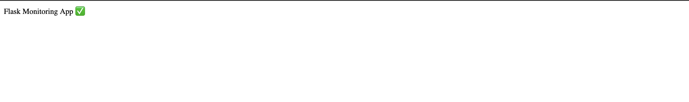
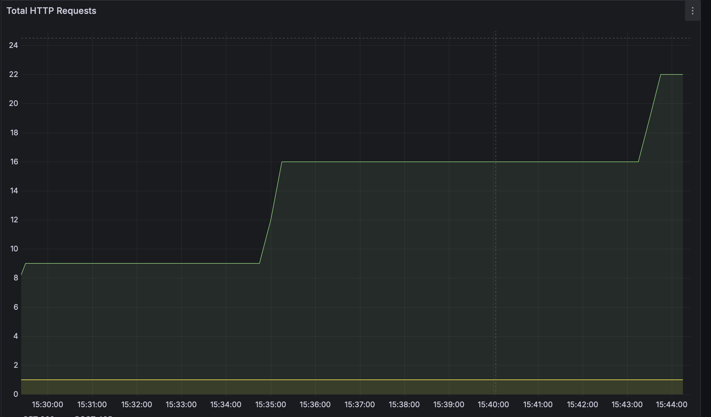
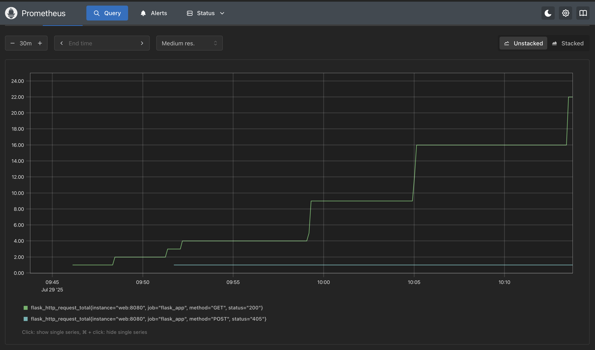

# Flask + Prometheus + Grafana Monitoring

A **Flask web application** with **Prometheus and Grafana monitoring** using Docker Compose.  
This project demonstrates **DevOps observability and monitoring skills**.

---

## 🚀 Features

- Flask app exposing `/metrics` for Prometheus
- Prometheus scrapes metrics every 5s
- Grafana dashboard with:
  - Total HTTP requests per endpoint
  - Request duration (latency)
  - Exceptions count
- Runs as a **multi-container setup** with Docker Compose

---

### 1️⃣ Clone the Repository

```bash
git clone git@github.com:alphatushar/flask-monitoring-app.git
cd flask-monitoring-app
```

### Example




---

### Author
Tushar Sharma